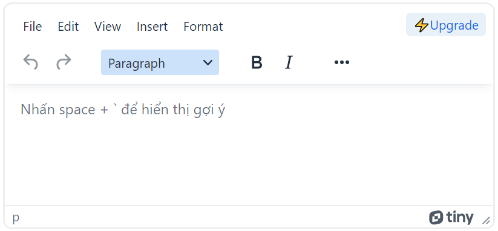

# WORD RECOMMENDATION


## Introduction
Word recommendation system is a system that supports real-time text suggestions. When users use the "space" + "`", a series of suggested paragraphs will appear. The number of suggestions displayed and the number of suggested words are pre-set. word recommendation system will help users operate faster during the typing process.<br>

<p align="center">
  
</p>
<br>


## Table of Contents
- [Introduction](#introduction)
- [Table of Contents](#table-of-contents)  
- [Prerequisites](#prerequisites)
- [Folder structure](#folder-structure)
  - [Configuration](#configuration-configpy)
  - [Data Handling](#data-handling-datasetspy)
  - [Model Structure](#model-structure-modelpy)
  - [Training model](#training-model-trainpytrain_modelipynb)
  - [Testing trained model](#testing-trained-model-inferencepy)
  - [Application Programming Interface](#application-programming-interface-word_recommend_apipy)
  - [Docker]()
- [Installation](#installation)
  - [Installing from source](#installing-from-source-recommended)
  - [For anaconda3](#for-anaconda3)
- [Training And Testing](#training-and-testing)
  - [Train](#train)
  - [Inference](#inference)
  - [Application](#application)


## Prerequisites
- Python version: ~3.11
- Conda version: ~2.5 (option)


## Folder structure
WORD RECOMMENDATION<br>
├──&nbsp;&nbsp;data <br>
&nbsp;|&nbsp;&nbsp;&nbsp;&nbsp;&nbsp;&nbsp;├──&nbsp;&nbsp;data_19_9_2023.txt <br>
&nbsp;|&nbsp;&nbsp;&nbsp;&nbsp;&nbsp;&nbsp;├──&nbsp;&nbsp;tokenizer.picker <br>
&nbsp;|&nbsp;&nbsp;&nbsp;&nbsp;&nbsp;&nbsp;├──&nbsp;&nbsp;vietnamese-stopwords.txt <br>
&nbsp;|&nbsp;&nbsp;&nbsp;&nbsp;&nbsp;&nbsp;├──&nbsp;&nbsp;word_dict.txt <br>
├──&nbsp;&nbsp;pretrain <br>
&nbsp;|&nbsp;&nbsp;&nbsp;&nbsp;&nbsp;&nbsp;└──&nbsp;&nbsp;word_recommendation.h5 <br>
├──&nbsp;&nbsp;doc <br>
&nbsp;|&nbsp;&nbsp;&nbsp;&nbsp;&nbsp;&nbsp;├──&nbsp;&nbsp;build_docker_img_en.md <br>
&nbsp;|&nbsp;&nbsp;&nbsp;&nbsp;&nbsp;&nbsp;├──&nbsp;&nbsp;build_docker_img_vi.md  <br>
&nbsp;|&nbsp;&nbsp;&nbsp;&nbsp;&nbsp;&nbsp;├──&nbsp;&nbsp;docker_pull_en.md <br>
&nbsp;|&nbsp;&nbsp;&nbsp;&nbsp;&nbsp;&nbsp;├──&nbsp;&nbsp;docker_pull_vi.md <br>
├──&nbsp;&nbsp;images <br>
&nbsp;|&nbsp;&nbsp;&nbsp;&nbsp;&nbsp;&nbsp;└──&nbsp;&nbsp;web_img.png <br>
├──&nbsp;&nbsp;src <br>
&nbsp;|&nbsp;&nbsp;&nbsp;&nbsp;&nbsp;&nbsp;├──&nbsp;&nbsp;config.py <br>
&nbsp;|&nbsp;&nbsp;&nbsp;&nbsp;&nbsp;&nbsp;├──&nbsp;&nbsp;datsets.py <br>
  &nbsp;|&nbsp;&nbsp;&nbsp;&nbsp;&nbsp;&nbsp;├──&nbsp;&nbsp;inference.py <br>
  &nbsp;|&nbsp;&nbsp;&nbsp;&nbsp;&nbsp;&nbsp;├──&nbsp;&nbsp;model.py  <br>
  &nbsp;|&nbsp;&nbsp;&nbsp;&nbsp;&nbsp;&nbsp;├──&nbsp;&nbsp;train.py <br>
  &nbsp;|&nbsp;&nbsp;&nbsp;&nbsp;&nbsp;&nbsp;├──&nbsp;&nbsp;train_model.ipynb <br>
  &nbsp;|&nbsp;&nbsp;&nbsp;&nbsp;&nbsp;&nbsp;├──&nbsp;&nbsp;word_recommend_api.py <br>
├──&nbsp;&nbsp;index.html <br>
├──&nbsp;&nbsp;requirement.txt <br>


### Configuration [config.py](src/config.py)
The ```config.py``` file contains configuration settings used throughout the application:
- **MODEL_SAVE_PATH**: Path to save trained model files<br>
- **DATA_FILE_PATH** : Path to data files(.txt format)<br>
- **TOKENIZER_PATH**: Path to tokenizer file <br>
- **OUTPUT_DIM**: Specifies the dimensionality of the output of the embedding layer and biLSTM layer.  <br>
- **DROPOUT_THRESHOLD**: Determine the threshold for the first biLSTM layer. <br>
- **LEARNING_RATE**: Adam optimizer learning rate. <br>
- **BATCH_SIZE**: Batch size refers to the number of data samples used in each iteration during the training process.   <br>
- **EPOCHS**: An epoch is a single pass through the entire training dataset during the training process of a machine learning model. <br>
- **NUM_NEXT_WORDS**: The next number of words you want to predict. <br>
- **NUM_SAMPLES**: The number of predictions you want to make. <br>
- **MAX_SEQ_LEN**: Set maximum sentence length. <br>

### Data Handling [datasets.py](src/datasets.py)
The ```datasets.py``` file handles data fetching and preprocessing:
- Load data from file path.
- Tokenize, remove special characters, lowercase.
- Prepares features and target variables for model training.
- More about [data](data/README.md)

### Model Structure [model.py](src/model.py)
The ```model.py``` create the architecture of the LSTM model for compile, train and save.

### Training model [train.py](src/train.py)
The ```train.py``` perform training on data loaded from ```datasets.py``` and model built from ```model.py```.<br>

### Training model on Google Colab[train_model.ipynb](src/train_model.ipynb)
The ```train_model.ipynb``` perform training on Google Colab. The data preprocessing steps and model structure are the same as local training.


### Testing trained model [inference.py](src/inference.py)
Check the results of the trained model, the  ```inference.py``` contains functions for testing.<br>
- Load trained model and ```tokenizer.pickle```.
- Embbeding input as same as input for training model.
- Take the top 3 words that return the highest probabilities, randomly return 1 of those 3 words.
- User can type input text , number of suggestions displayed and number of suggested words to test model.

### Application Programming Interface [word_recommend_api.py](src/word_recommend_api.py)
Build API:
- Use Werkzeug and Flask.
- Receives data entered by the user from the web interface, uses ```inference.py``` to return the predicted word.
- User interface use HTML and TinyMCE - a rich-text editor that allows users to create formatted content within a user-friendly interface

### Docker
- Instructions for building Docker images. ([vietnamese](doc/build_docker_img_vi.md), [english](doc/build_docker_img_en.md))
- Instruction for download and run container applications in your computer. ([vietnamese](doc/docker_pull_vi.md), [english](doc/docker_pull_en.md))

## Installation
For training and testing, you should use ```git clone``` for 
installing all necessary packages.

### Installing from source (recommended)
```
git clone https://github.com/khanhng29/word_recommend.git
cd word_recommend
pip install -r requirement.txt
```

### For anaconda3:
```
conda create -y -n word_recommend python=3.11
conda activate word_recommend
git clone https://github.com/khanhng29/word_recommend.git
cd word_recommend
pip install -r requirement.txt
```
## Training And Testing

#### Train
For training, you need to check the data path is set in ```config.py```. After training, you can check the model in the pretrain folder.
If you don't want to train on local. You can use ```train_model.ipynb``` to train on Google colab and download the training results saved as a ```.h5``` file.<br>
To training on local:
```
python ./src/train.py
```

#### Inference
To test the trained model, run the ```inference.py``` file. When running this file you can type your text , number of suggestions displayed and number of suggested words.
```
python ./src/inference.py
```

#### Application
To use web application, run word_recommend_api.py
```
python ./src/word_recommend_api.py
```
Get your local IP address from the active session, then update line 31 in the ```index.html``` file with this IP. Finally, open the index.html file in your browser to run web application.


  
